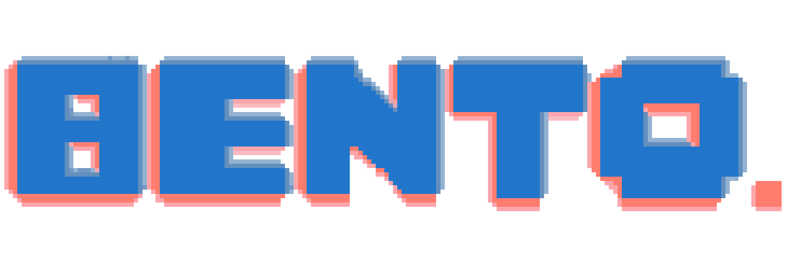

<p align="center">

</p>

# bento

2D Game Engine written in Odin with SDL3.

# Installation

## Dependencies

- Odin
- SDL3
- SDL_ttf

To use the library either use git submodules or just copy the `src` folder into your project.

Use collections to compile, e.g.

```odin
odin run . -collection:bento=src
```

# Examples

For convinience, there is a examples folder that holds some simple examples to get started with. It also shows how to idiomatically use this library.

Run examples from the root of the directory with,

```odin
odin run ./examples/{example_name}/{example_name}.odin -file -collection:bento=src
```
or if using the Makefile,

```odin
make run-example example={example_name} // e.g. make run-example example=rectangle
```
A full example of rectangle.odin,

```odin
// examples/rectangle/rectangle.odin

package rectangle

import "bento:engine"
import "bento:execute"

// -- Globals -- //


// Game state that will hold relevant global data
// for the life of the game
state: ^engine.GameState

screen_width: int // width of the screen in pixels
screen_height: int // height of the screen in pixels

// -- Main Loop -- //

main :: proc() {
	// main proc, set game function pointers
	platform_config := engine.PlatformConfig {
		title         = "rectangle",
		window_width  = 800,
		window_height = 600,
		fullscreen    = false,
		scale_mode    = .LINEAR,
	}

	game_data := execute.Game {
		platform_config = platform_config,
		game_init       = init,
		game_update     = update,
		game_render     = render,
		game_shutdown   = shutdown,
	}

	// start main loop
	execute.engine_run(&game_data)
}


// -- Game Functions -- //

init :: proc(platform: ^engine.Platform) {

	// create new instance of gamestate
	err: engine.Error
	state, err = engine.game_state_new(platform)
	if err != nil {
		panic(engine.fmt_error(err, context.temp_allocator))
	}

	// fill in screen_width and height
	screen_width, screen_height = state.platform.get_window_size()
}

update :: proc(input: ^engine.GameInput, dt: f64) -> bool {
	return true
}

render :: proc() -> ^engine.RenderCommandBuffer {
	// reset command buffer, it is being allocated in the hot loop
	// resetting here makes sure that memory doesnt build up
	engine.cmd_reset(state.cmdbuf)


	// set rect width
	rect_width := f64(screen_width) * 0.25

	// flush screen with a blank color
	engine.cmd_clear_screen(state.cmdbuf, engine.WHITE)

	// draw red rectangle in the center of the screen
	engine.cmd_draw_rect(
		state.cmdbuf,
		engine.rect(
			f64(screen_width) / 2 - 0.5 * rect_width,
			f64(screen_height) / 2 - 0.5 * rect_width,
			rect_width,
			rect_width,
		),
		engine.RED,
	)
	return state.cmdbuf
}

shutdown :: proc() {
	// free state
	engine.game_state_destroy(state)
}


```

# License

[license](LICENSE.txt)


